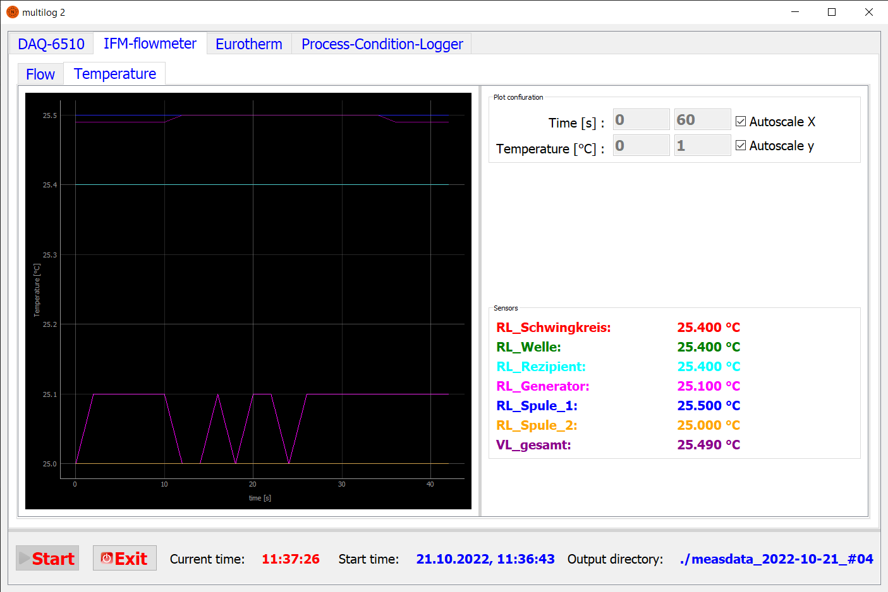

# multilog
[](https://zenodo.org/badge/latestdoi/419782987)
[](https://multilog.readthedocs.io/en/latest/?badge=latest)

Measurement data recording and visualization using various devices, e.g., multimeters, pyrometers, optical or infrared cameras.



The project is developed and maintained by the [**Model experiments group**](https://www.ikz-berlin.de/en/research/materials-science/section-fundamental-description#c486) at the Leibniz-Institute for Crystal Growth (IKZ).

### Referencing

If you use this code in your research, please cite our open-access article:

> A. Enders-Seidlitz, J. Pal, and K. Dadzis, Model experiments for Czochralski crystal growth processes using inductive and resistive heating *IOP Conference Series: Materials Science and Engineering*, 1223 (2022) 012003. https://doi.org/10.1088/1757-899X/1223/1/012003.

## Supported devices

Currently, the following devices are supported:

- Keithley DAQ6510 multimeter (RS232)
- Lumasense pyrometers (RS485):
  - IGA-6-23
  - IGAR-6
  - Series-600
- Basler optical cameras (Ethernet)
- Optris IP-640 IR camera (USB)
- Eurotherm controller (RS232)
- IFM flowmeter (Ethernet)

Additional devices may be included in a flexible manner.

## Usage

multilog is configured by default using the file *config.yml* in the main directory. Outputs are written to the working directory. A template [*config_template.yml*](./config_template.yml), including all supported measurement devices, is provided in this repository; please create a copy of this file and adjust it to your needs. Further details are given below.

To run multilog execute the python file [*multilog.py*](./multilog.py):

```shell
python3 ./multilog.py
```

Alternatively, multilog can be started with the optional command line arguments `-c` and `-o` to give an individual config file and output directory.

```shell
python3 ./multilog.py -c ./my_config_file.yml -o ../my_output_dir
```

If everything is configured correctly, the GUI window opens up. Sampling is started immediately for verification purposes, but the measurements are not recorded yet. Once the *Start* button is clicked, the directory "measdata_*date*_#*XX*" is created and samplings are saved to this directory in csv format. A separate file (or folder for images) is created for each measurement device.

multilog is built for continuous sampling. In case of problems, check the log file for errors and warnings!

## Configuration

multilog is configured using the file *config.yml* in the main directory or a user-defined config-file provided using the `-c` argument. A template [*config_template.yml*](./config_template.yml) including all supported measurement devices is provided in this repository; please create a copy of this file and adjust it to your needs.

### Main settings

In the *settings* section of the config-file the sampling time steps are defined (in ms):

- dt-main: main time step for sampling once the recording is started. Used for all devices except cameras.
- dt-camera: time step for sampling of cameras.
- dt-camera-update: time step for updating camera view. This value should be lower than dt-camera (to get a smooth view) but not lower than exposure + processing time.
- dt-init: time step used for sampling before recording is started.

### Logging

The logging is configured in the *logging* section of the config-file. The parameters defined are passed directly to the [basicConfig-function](https://docs.python.org/3/library/logging.html#logging.basicConfig) of Python's logging module.

### Devices

The *devices* section is the heart of multilog's configuration and contains the settings for the measurement devices. You can add any number of supported devices here. Just give them an individual name. A separate tab will be created in the GUI for each device. The device type is defined by the name as given in *config-template.yml*, e.g. "DAQ-6510", "IFM-flowmeter", or "Optris-IP-640", and must always be contained in this name; extensions are possible (e.g., "DAQ-6510 - temperatures").

#### DAQ-6510 multimeter

For the Keithley DAQ6510 multimeter, the following main settings are available:

- serial-interface: configuration for [pyserial](https://pyserial.readthedocs.io/en/latest/pyserial_api.html#serial.Serial)
- settings: currently, some channel-specific settings are defined globally. This will be changed in the future.
- channels: flexible configuration of the device's channels for measurement of temperatures with thermocouples / Pt100 / Pt1000 and ac / dc voltages. Conversion of voltages into different units is possible (see "rogowski" in config_template.yml).

#### IFM-flowmeter

The main configurations (IP, ports) should be self-explaining. If the section "flow-balance" is included in the settings, in- and outflows are balanced to check for leakage. This is connected to a discord-bot for automatized notification; the bot configuration is hard-coded in [*discord_bot.py*](./multilog/discord_bot.py).

#### Eurotherm controller

Temperature measurement and control operation points are logged. Configuration of:

- serial-interface: configuration for [pyserial](https://pyserial.readthedocs.io/en/latest/pyserial_api.html#serial.Serial)

#### Lumasense IGA-6-23 / IGAR-6-adv / Series-600 pyrometer

The configuration of the Lumasense pyrometers includes:

- serial-interface: configuration for [pyserial](https://pyserial.readthedocs.io/en/latest/pyserial_api.html#serial.Serial)
- device-id: RS485 device id (default: '00')
- transmissivity
- emissivity
- t90

#### Basler optical camera

The camera is connected using ethernet. Configuration of:

- device number (default: 0)
- exposure time
- framerate
- timeout
- Output File Format (tiff: lossless but 15MB per picture or jpeg: with losses but <1MB per picture.)

A Script to convert the .tiff data to .png data (also lossless but only 5MB per picture) can be found in the postprocessing folder.

__If two Cameras are conected the Framerate will only be half of the set Framerate!__

#### Optris-IP-640 IR camera

Configuration according to settings in [FiloCara/pyOptris](https://github.com/FiloCara/pyOptris/blob/dev/setup.py), including:

- measurement-range
- framerate
- emissivity
- transmissivity

## Dependencies

multilog runs with python >= 3.8 on both Linux and Windows (Mac not tested). The main dependencies are the following python packages:

- matplotlib
- numpy
- PyQT5
- pyqtgraph
- pyserial
- PyYAML

Depending on the applied devices multilog needs various additional python packages. A missing device-specific dependency leads to a warning. Always check the log if something is not working as expected!

#### IFM-flowmeter

- requests

For the discord bot there are the following additional dependencies:

- dotenv
- discord

#### Basler optical camera

- pypylon
- Pillow

#### Optris-IP-640 IR camera

- pyoptris and dependencies installed according to https://github.com/nemocrys/pyOptris/blob/dev/README.md

### Logging of own version

- git (will be called as a subprocess if available)

## NOMAD support

NOMAD support and the option to upload measurement data to [NOMAD](https://nomad-lab.eu/) is under implementation. Currently, various yaml-files containing a machine-readable description of the measurement data are generated.

## Documentation

To get an overview of the program have a look at [multilog's Read the Docs page](https://multilog.readthedocs.io/en/latest/). It includes a short description of how to implement a new device. In case of questions please open an issue!

## License

This code is available under a GPL v3 License. Parts are copied from [FiloCara/pyOptris](https://github.com/FiloCara/pyOptris/blob/dev/setup.py) and available under MIT License.

## Support

In case of questions please [open an issue](https://github.com/nemocrys/multilog/issues/new)!

## Acknowledgements

[This project](https://nemocrys.github.io/) has received funding from the European Research Council (ERC) under the European Union's Horizon 2020 research and innovation programme (grant agreement No 851768).


## Contribution

Any help to improve this code is very welcome!
